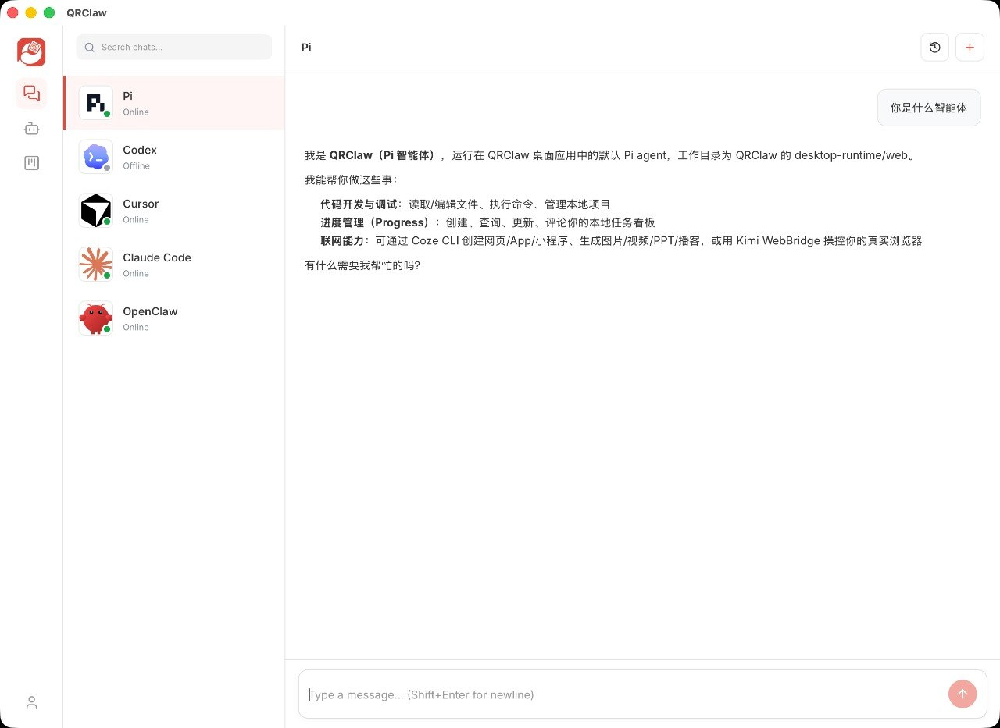
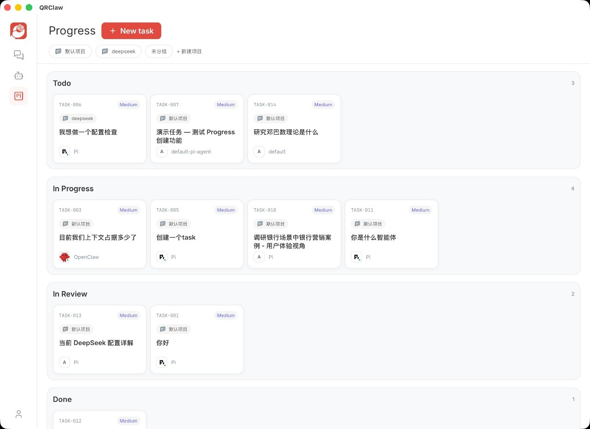

<p align="center">
  
</p>

<h1 align="center">QRClaw</h1>

<p align="center">
  A unified macOS desktop workspace for managing multiple AI agents, conversations, and tasks in one place.
</p>

<p align="center">
  <a href="./LICENSE"></a>
  
  
  
</p>

<p align="center">
  <a href="./README.zh.md">🇨🇳 中文</a>
</p>

---

## Table of Contents

- [Overview](#overview)
- [Features](#features)
  - [Smart Conversation](#1-smart-conversation)
  - [Task Board](#2-task-board)
  - [Agent Management](#3-agent-management)
  - [Conversation-Task Linkage](#4-conversation-task-linkage)
  - [History Replay](#5-history-replay)
  - [Model Selection](#6-model-selection)
  - [Profile Center](#7-profile-center)
- [Download & Install](#download--install)
- [Development](#development)
- [Tech Stack](#tech-stack)
- [Project Structure](#project-structure)
- [Contributing](#contributing)
- [License](#license)

---

## Overview

QRClaw brings your local AI agents — Codex, Cursor, Claude Code, OpenClaw, Pi, and more — into a single macOS desktop application. Switch between agents like switching contacts, run multi-turn conversations, automatically track tasks, and keep full context history across sessions.

## Features

### 1. Smart Conversation

- **Agent-organized sidebar:** Conversations are grouped by agent in the left sidebar; the right panel shows the active multi-turn private chat.
- **Switch agents like contacts:** Switch between agents and carry out multi-turn private chats, centralizing different tasks in one place.
- **Streaming output with execution timeline:** Responses stream in real time, with an execution-process timeline displayed alongside.
- **New conversation:** Click "New Conversation" to clear context and start a fresh session.
- **History search:** Enter keywords in the search box to match and locate across conversations and messages.
- **Exception handling:** Prompts when a runtime goes offline; replays missed messages after network reconnection; marks failed steps on the execution timeline.



### 2. Task Board

- Tasks generated in conversations are organized into columns on the board.
- Drag-and-drop reordering and status changes.
- Task cards display title, associated agent, update time, and a quick-jump link to the source conversation.
- Filter by agent and search by keyword.
- Task status flow: To Do → In Progress → To Verify → Done.
- Mark a task as "Blocked" with a reason when obstacles arise.



### 3. Agent Management

- View locally installed agent runtimes (Codex, Cursor, Claude Code, OpenClaw, Pi, etc.).
- Manage display names and roles for each agent to clarify responsibilities.
- View real-time online status of each runtime.

### 4. Conversation-Task Linkage

- Create task cards directly from a conversation onto the board.
- Jump into the associated conversation from a task detail page to continue with full context.
- Automatically create tasks from conversations and write back progress before resuming, so goals are never lost.

### 5. History Replay

- After refreshing or re-logging in, all historical messages are visible.
- Includes associated conversations and task statuses.
- Messages are persisted and never lost.

### 6. Model Selection

- Specify a model for a single conversation, trading off speed and quality as needed.

### 7. Profile Center

- Manage personal profile such as avatar and display name.
- macOS desktop supports automatic update detection.

---

## Download & Install

### macOS

1. Download the installer: [`QRClaw-0.1.3.dmg`](https://github.com/hellozim22/QRclaw_release/releases/latest/download/QRClaw-0.1.3.dmg)
2. Open the `.dmg` file and drag **QRClaw** into the **Applications** folder.
3. On first launch, if macOS blocks the app because it is from an unidentified developer:
   - Open **System Settings → Privacy & Security**.
   - Scroll down and click **Open Anyway** next to the "QRClaw was blocked" message.
   - Confirm and launch QRClaw.

---

## Development

### Prerequisites

- **Node.js** >= 20
- **pnpm** >= 9
- **Go** >= 1.22
- **Redis**
- **Supabase** (local or cloud)

### Getting Started

```bash
# Clone the repository
git clone https://github.com/hellozim22/QRclaw-release.git
cd QRclaw-release

# Install dependencies
pnpm install

# Start the frontend (Next.js)
pnpm dev:web

# Start the gateway (Express + WebSocket)
pnpm dev:gateway

# Start the agent host (Go)
cd qrclaw-agent-host && go run .
```

---

## Tech Stack

| Layer            | Technology                          |
|------------------|-------------------------------------|
| Frontend         | Next.js 16, React 19, Tailwind CSS  |
| Gateway          | Express 5, WebSocket                |
| Agent Runtime    | Go                                  |
| Backend / Auth   | Supabase                            |
| Cache / Pub-Sub  | Redis                               |
| Desktop          | SwiftUI (macOS)                     |
| Shared Types     | shared/contracts                    |
| Testing          | Vitest, Playwright                  |

---

## Project Structure

```
QRclaw-release/
├── web/                    # Next.js 16 frontend
├── gateway/                # Express 5 Gateway + WebSocket
├── qrclaw-agent-host/      # Go agent runtime
├── apps/macos/QRClaw/      # SwiftUI macOS desktop app
├── supabase/               # Database schema & Edge Functions
├── shared/contracts/       # Shared type contracts
├── tests/                  # Vitest / Playwright / E2E tests
├── docs/                   # Product, deployment, desktop update docs
├── design/                 # Design assets
├── scripts/                # Build & release scripts
├── download/               # macOS desktop installer
├── plugins/openclaw/       # OpenClaw channel plugin
└── .claude/                # Claude Code Agent config
```

---

## Contributing

Contributions are welcome. Please follow these steps:

1. Fork the repository.
2. Create a feature branch: `git checkout -b feat/your-feature`.
3. Commit your changes with clear messages.
4. Push to your fork and open a Pull Request.

Please ensure tests pass before submitting a PR.

---

## License

This project is licensed under the [Apache License 2.0](./LICENSE).
