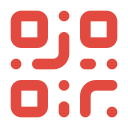

#  QRClaw

本地优先的多智能体协作平台 — 像聊天一样管理你的 AI Agent。

[](LICENSE)
[](https://github.com/hellozim22/QRclaw-release)
[](https://nodejs.org)
[](https://go.dev)

---

## 功能特性

| 模块 | 说明 |
|------|------|
| **Chat** | 像聊天软件一样，与不同 Agent 分别对话，每条消息都有独立上下文 |
| **Agents** | 查看、配置和连接本机 Agent 运行时（Codex、Cursor、Claude Code、OpenClaw、Pi 等） |
| **Progress** | 将长对话沉淀为任务，以看板方式跟踪进度，告别信息过载 |
| **个人中心** | 管理头像与名称，内置 macOS 桌面端更新检测 |

---

## 快速上手

### 普通用户：通过 DMG 安装（macOS）

1. **下载 DMG 文件**

   从本仓库 `download/` 目录直接下载最新版本：
   - 文件路径：[`download/QRClaw-0.1.1.dmg`](./download/QRClaw-0.1.1.dmg)（约 150 MB）
   - 你也可以从 [GitHub Releases](https://github.com/hellozim22/QRclaw-release/releases) 页面获取历史版本

2. **安装**

   - 双击下载的 `QRClaw-0.1.1.dmg` 挂载磁盘映像
   - 将 `QRClaw.app` 拖入 `Applications` 文件夹
   - 弹出磁盘映像即可

3. **启动**

   - 从 `Applications` 或 Launchpad 打开 QRClaw
   - 首次启动时，如果 macOS 提示"无法验证开发者"，请前往 **系统设置 → 隐私与安全性**，点击"仍要打开"即可放行

> **系统要求：** macOS 14（Sonoma）及以上

### 开发者：从源码启动

**前置依赖**

- Node.js ≥ 22
- Go 1.22+
- Redis（本地或远程）
- Supabase 项目（PostgreSQL）

**克隆与安装**

```bash
git clone https://github.com/hellozim22/QRclaw-release.git
cd QRclaw-release

# 前端
npm install
```

**启动开发环境**

```bash
# 方式一：一键启动（推荐）
bash scripts/dev-up.sh

# 方式二：分别启动
# 终端 1 — 启动 Gateway
cd gateway && npm run dev

# 终端 2 — 启动 Web 前端
cd web && npm run dev

# 终端 3 — 启动 Agent Host（可选）
cd qrclaw-agent-host && go run ./cmd/qrclaw-agent-host run
```

启动后访问 `http://localhost:3000` 即可。

---

## 技术栈

| 层级 | 技术 |
|------|------|
| **前端** | Next.js 16 · React 19 · Tailwind CSS v4 · TypeScript |
| **后端** | Express 5 (Gateway) · WebSocket · Redis |
| **Agent Host** | Go 1.22 |
| **数据库** | Supabase (PostgreSQL) |
| **桌面端** | SwiftUI (macOS 14+) |
| **测试** | Vitest · Playwright |

---

## 项目结构

```
QRclaw-release/
├── web/                    # Next.js 16 前端
├── gateway/                # Express 5 Gateway + WebSocket
├── qrclaw-agent-host/      # Go Agent 运行时
├── apps/macos/QRClaw/      # SwiftUI macOS 桌面端
├── supabase/               # 数据库 Schema 与 Edge Functions
├── shared/contracts/       # 共享类型契约
├── tests/                  # Vitest / Playwright / E2E 验证
├── docs/                   # 产品、部署、桌面更新文档
├── design/                 # 设计资源
├── scripts/                # 构建与发布脚本
├── download/               # macOS 桌面安装包
├── plugins/openclaw/       # OpenClaw 通道插件
└── .claude/                # Claude Code Agent 配置
```

---

## 贡献指南

欢迎提交 Issue 和 Pull Request。

1. Fork 本仓库
2. 创建特性分支：`git checkout -b feat/your-feature`
3. 提交变更：`git commit -m "feat: 描述你的变更"`
4. 推送到分支：`git push origin feat/your-feature`
5. 提交 Pull Request

请确保代码通过 lint 检查和现有测试。

---

## 许可证

本项目基于 [Apache 2.0 许可证](LICENSE) 开源。
