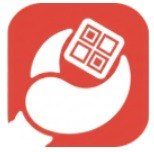
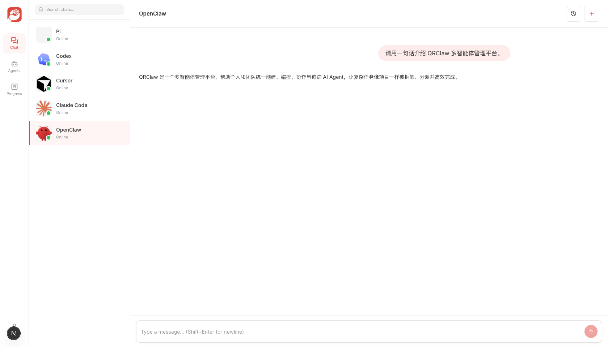
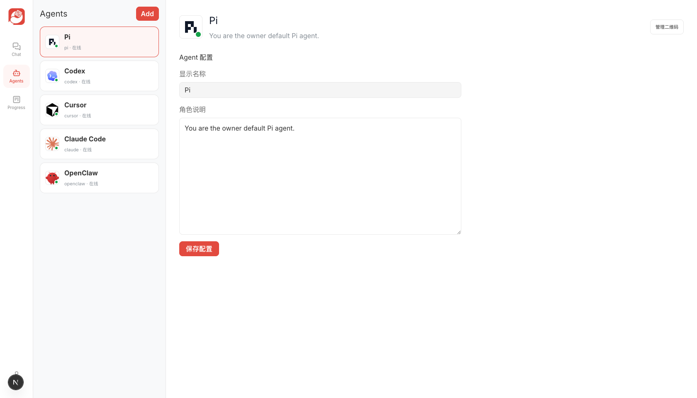
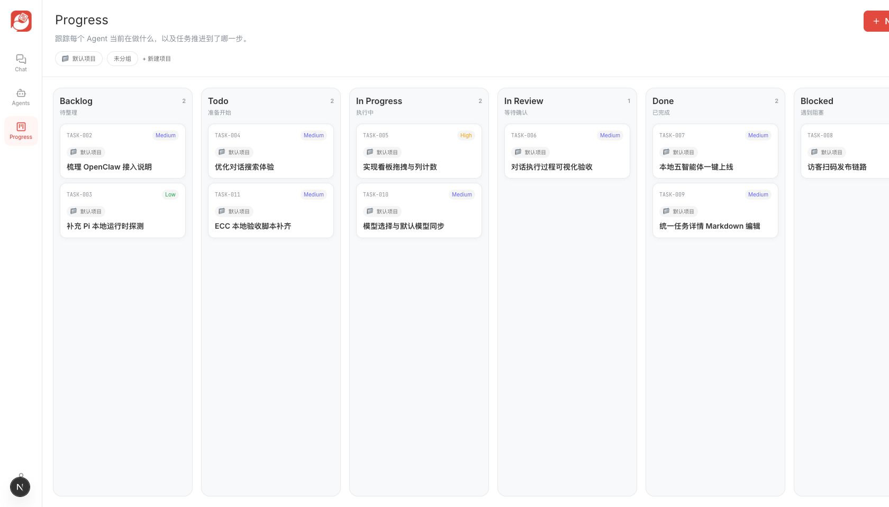
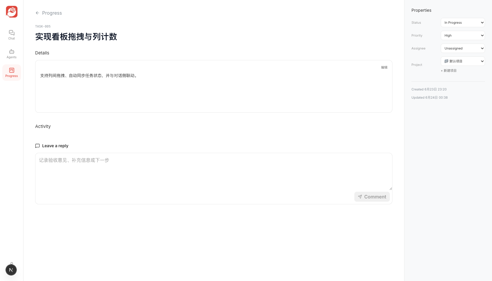

#  QRClaw

本地优先的多智能体协作平台 — 像聊天一样管理你的 AI Agent

[](LICENSE)
[](https://github.com/hellozim22/QRclaw-release)
[](https://nodejs.org)
[](https://go.dev)

---

## 功能特性

### Chat — 独立对话

按 Agent 划分独立会话窗口，支持多 Agent 并行对话，就像用聊天软件分别与不同的人聊天。每个 Agent 拥有独立的上下文和历史记录，互不干扰。



---

### Agents — 运行时管理

查看本机已安装的 Agent 运行时（Codex、Cursor、Claude Code、OpenClaw、Pi 等），一键配置连接，统一管理 Agent 生命周期。无需命令行操作，图形界面完成全部配置。



---

### Progress — 任务看板

将长对话中的待办事项沉淀为结构化任务，在看板中跟踪进度。支持任务创建、状态流转、详情查看，让 AI 对话产出可追溯、可度量。



---

### Progress — 任务详情

每个任务承载完整的上下文信息：关联对话、执行状态、参与 Agent、时间线等，确保协作过程透明可审计。



---

### 个人中心

管理头像、名称等个人资料，macOS 桌面端支持自动更新检测。

---

## 快速上手

### 普通用户 — macOS 桌面端安装

1. 下载 DMG 安装包：[`QRClaw-0.1.1.dmg`](./download/QRClaw-0.1.1.dmg)（约 150 MB）
2. 双击打开 DMG，将 `QRClaw.app` 拖入 `Applications` 文件夹
3. 首次打开时，在「系统设置 > 隐私与安全性」中点击「仍要打开」以信任开发者
4. 启动后按引导完成 Agent 运行时配置，即可开始使用

> 系统要求：macOS 14 (Sonoma) 或更高版本

### 开发者 — 源码启动

```bash
# 克隆仓库
git clone https://github.com/hellozim22/QRclaw-release.git
cd QRclaw-release

# 安装前端依赖并启动
cd web
pnpm install
pnpm dev

# 启动 Gateway（新终端）
cd gateway
pnpm install
pnpm dev

# 启动 Agent Host（新终端）
cd qrclaw-agent-host
go run ./cmd/host
```

详细的开发环境配置请参阅 [`docs/`](./docs/) 目录。

---

## 技术栈

| 层级 | 技术 |
|------|------|
| 前端 | Next.js 16 · React 19 · Tailwind CSS v4 · TypeScript |
| 后端 | Express 5 · WebSocket · Redis |
| Agent Host | Go 1.22 |
| 数据库 | Supabase (PostgreSQL) |
| 桌面端 | SwiftUI (macOS 14+) |
| 测试 | Vitest · Playwright |

---

## 项目结构

```
QRclaw-release/
├── web/                    # Next.js 16 前端
├── gateway/                # Express 5 Gateway + WebSocket
├── qrclaw-agent-host/      # Go Agent 运行时
├── apps/macos/QRClaw/      # SwiftUI macOS 桌面端
├── supabase/               # 数据库 Schema 与 Edge Functions
├── shared/contracts/       # 共享类型契约
├── tests/                  # Vitest / Playwright / E2E 验证
├── docs/                   # 产品、部署、桌面更新文档
├── design/                 # 设计资源
├── scripts/                # 构建与发布脚本
├── download/               # macOS 桌面安装包
├── plugins/openclaw/       # OpenClaw 通道插件
└── .claude/                # Claude Code Agent 配置
```

---

## 贡献指南

欢迎提交 Issue 和 Pull Request。

1. Fork 本仓库，创建特性分支 `feat/your-feature`
2. 确保代码通过 lint 检查和现有测试
3. 提交 Pull Request 并关联对应 Issue

---

## 许可证

[Apache 2.0](./LICENSE) © QRClaw Contributors
