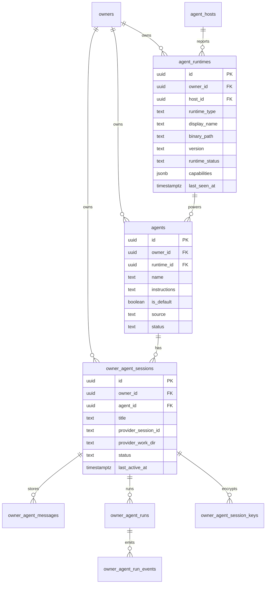

# Wave 10 R1: Runtime / Agent / Session 数据模型

> 目标：支撑“本机 CLI 自动识别 → 默认 Agent 自动可聊 → 一个 Agent 多个按话题分的 Session”，同时保留 Wave 5-9 的加密存储、Host WS、`decrypted-messages` 回放资产。

## 结论

推荐做一次 **rename-first migration**，不是新建平行表：

- 新增 `agent_runtimes`：每个 owner 的本机 CLI runtime SSoT，覆盖 openclaw / claude / cursor / codex，后续允许新增类型。
- `agents.runtime_id` 成为 Agent 的执行器绑定；现有 schema 没有 `agents.backend_provider`，Wave 10 中所有 backend_provider-like 语义由 `runtime_id` + `agent_runtimes.runtime_type` 承接，`agent_bindings.provider` 进入兼容期后退役。
- `owner_agent_conversations` 重命名为 `owner_agent_sessions`，语义从“一对一执行容器”升级为“一个 agent 可有多个话题 session”。
- 删除 `UNIQUE(owner_id, agent_id)`，新增 `title`，并加 `UNIQUE(owner_id, agent_id, title)` 的弱防重索引。
- 保留 `owner_agent_messages` / `owner_agent_runs` / key 表的 C2 加密职责，只把 FK 语义从 conversation 改成 session。

## 字段决策

| 问题 | 决策 |
|---|---|
| `runtime_type` 用 enum 还是 text | 用 `text`，不使用 Postgres enum。Wave 10 已明确未来可能扩展 CLI/runtime，enum 会让每次新增 provider 都变成 schema migration。 |
| `runtime_status` | 用 `text CHECK (runtime_status IN ('online','offline','updating'))`。状态集合小且驱动 UI，应该有 DB 约束。 |
| `instructions` | 保持 `text` + `length <= 8000`，不改 `varchar(n)`。Postgres `text` 没有 255 陷阱，现有约束已足够。 |
| 默认 Agent | `agents.is_default boolean`。默认 agent 是系统自动 provision 的 agent，不是 runtime 本身。配合 `source` 区分 `system_default` / `user_created`。 |
| 同 agent 多 session | `owner_agent_sessions` 不再有 `(owner_id, agent_id)` 唯一约束；以 `title`、`last_active_at`、`status` 做列表和归档。 |

## ERD



## SQL migration 草案

> 草案只表达形状；实际落库前还要按 Gateway / Edge Function / tests 同步改 API 和类型。

```sql
-- 1. Runtime SSoT
CREATE TABLE IF NOT EXISTS agent_runtimes (
  id uuid PRIMARY KEY DEFAULT gen_random_uuid(),
  owner_id uuid NOT NULL REFERENCES owners(id) ON DELETE CASCADE,
  host_id uuid REFERENCES agent_hosts(id) ON DELETE SET NULL,
  runtime_type text NOT NULL,
  display_name text NOT NULL,
  binary_path text,
  version text,
  runtime_status text NOT NULL DEFAULT 'offline',
  status_reason text,
  capabilities jsonb NOT NULL DEFAULT '{}'::jsonb,
  metadata jsonb NOT NULL DEFAULT '{}'::jsonb,
  last_seen_at timestamptz,
  created_at timestamptz NOT NULL DEFAULT now(),
  updated_at timestamptz NOT NULL DEFAULT now(),
  CONSTRAINT agent_runtimes_runtime_type_nonempty
    CHECK (length(trim(runtime_type)) > 0),
  CONSTRAINT agent_runtimes_status_check
    CHECK (runtime_status IN ('online', 'offline', 'updating'))
);

CREATE UNIQUE INDEX IF NOT EXISTS uniq_agent_runtimes_owner_host_type
  ON agent_runtimes(
    owner_id,
    (COALESCE(host_id, '00000000-0000-0000-0000-000000000000'::uuid)),
    runtime_type
  );

CREATE INDEX IF NOT EXISTS idx_agent_runtimes_owner_status
  ON agent_runtimes(owner_id, runtime_status, last_seen_at DESC);

CREATE TRIGGER set_updated_at_agent_runtimes
  BEFORE UPDATE ON agent_runtimes
  FOR EACH ROW EXECUTE FUNCTION update_updated_at_column();

ALTER TABLE agent_runtimes ENABLE ROW LEVEL SECURITY;
ALTER TABLE agent_runtimes FORCE ROW LEVEL SECURITY;

CREATE POLICY "agent_runtimes_owner_select" ON agent_runtimes
  FOR SELECT USING (owner_id IN (SELECT id FROM owners WHERE user_id = (SELECT auth.uid())));

CREATE POLICY "agent_runtimes_owner_insert" ON agent_runtimes
  FOR INSERT WITH CHECK (owner_id IN (SELECT id FROM owners WHERE user_id = (SELECT auth.uid())));

CREATE POLICY "agent_runtimes_owner_update" ON agent_runtimes
  FOR UPDATE USING (owner_id IN (SELECT id FROM owners WHERE user_id = (SELECT auth.uid())))
  WITH CHECK (owner_id IN (SELECT id FROM owners WHERE user_id = (SELECT auth.uid())));

CREATE POLICY "agent_runtimes_owner_delete" ON agent_runtimes
  FOR DELETE USING (owner_id IN (SELECT id FROM owners WHERE user_id = (SELECT auth.uid())));

-- 2. Backfill runtimes from Wave 1 host/provider capability rows.
INSERT INTO agent_runtimes (
  owner_id,
  host_id,
  runtime_type,
  display_name,
  binary_path,
  version,
  runtime_status,
  capabilities,
  last_seen_at
)
SELECT
  h.owner_id,
  hp.host_id,
  hp.provider,
  initcap(hp.provider),
  hp.binary_path,
  hp.version,
  CASE
    WHEN h.status = 'online' AND hp.status = 'available' THEN 'online'
    ELSE 'offline'
  END,
  hp.capabilities,
  GREATEST(h.last_seen_at, hp.health_check_passed_at)
FROM agent_host_providers hp
JOIN agent_hosts h ON h.id = hp.host_id
ON CONFLICT DO NOTHING;

-- 3. agents points to runtime; source/is_default distinguish auto-provisioned defaults.
ALTER TABLE agents
  ADD COLUMN IF NOT EXISTS runtime_id uuid REFERENCES agent_runtimes(id) ON DELETE SET NULL,
  ADD COLUMN IF NOT EXISTS is_default boolean NOT NULL DEFAULT false,
  ADD COLUMN IF NOT EXISTS source text NOT NULL DEFAULT 'user_created';

ALTER TABLE agents DROP CONSTRAINT IF EXISTS agents_source_check;
ALTER TABLE agents ADD CONSTRAINT agents_source_check
  CHECK (source IN ('system_default', 'user_created', 'imported'));

CREATE INDEX IF NOT EXISTS idx_agents_owner_runtime
  ON agents(owner_id, runtime_id);

CREATE UNIQUE INDEX IF NOT EXISTS uniq_agents_owner_default_runtime
  ON agents(owner_id, runtime_id)
  WHERE is_default = true AND runtime_id IS NOT NULL;

-- Compatibility backfill from agent_bindings.
UPDATE agents a
SET runtime_id = r.id
FROM agent_bindings b
JOIN agent_runtimes r
  ON r.owner_id = b.owner_id
 AND r.runtime_type = b.provider
 AND (b.preferred_host_id IS NULL OR r.host_id = b.preferred_host_id)
WHERE b.agent_id = a.id
  AND a.runtime_id IS NULL;

-- 4. Conversation -> Session rename.
ALTER TABLE owner_agent_conversations RENAME TO owner_agent_sessions;
ALTER TABLE owner_agent_sessions DROP CONSTRAINT IF EXISTS owner_agent_conversations_owner_agent_unique;

ALTER TABLE owner_agent_sessions
  ADD COLUMN IF NOT EXISTS title text NOT NULL DEFAULT 'New chat';

ALTER TABLE owner_agent_sessions DROP CONSTRAINT IF EXISTS owner_agent_sessions_title_length_check;
ALTER TABLE owner_agent_sessions ADD CONSTRAINT owner_agent_sessions_title_length_check
  CHECK (length(title) BETWEEN 1 AND 120);

ALTER TABLE owner_agent_sessions DROP CONSTRAINT IF EXISTS owner_agent_sessions_status_check;
ALTER TABLE owner_agent_sessions ADD CONSTRAINT owner_agent_sessions_status_check
  CHECK (status IN ('active', 'archived'));

ALTER INDEX IF EXISTS idx_owner_agent_conversations_owner_last_active
  RENAME TO idx_owner_agent_sessions_owner_last_active;

CREATE INDEX IF NOT EXISTS idx_owner_agent_sessions_agent_last_active
  ON owner_agent_sessions(owner_id, agent_id, last_active_at DESC);

CREATE UNIQUE INDEX IF NOT EXISTS uniq_owner_agent_sessions_owner_agent_title_active
  ON owner_agent_sessions(owner_id, agent_id, lower(title))
  WHERE status = 'active';

-- 5. Rename key table for clarity; message/run FK columns can be renamed in the same release
-- if Gateway, Edge Function, and generated types are updated together.
ALTER TABLE owner_agent_conversation_keys RENAME TO owner_agent_session_keys;
ALTER INDEX IF EXISTS idx_owner_agent_conversation_keys_conversation_status
  RENAME TO idx_owner_agent_session_keys_session_status;
ALTER INDEX IF EXISTS uniq_owner_agent_conversation_keys_active
  RENAME TO uniq_owner_agent_session_keys_active;

-- 6. Compatibility views for old readers during Wave 10 rollout.
CREATE OR REPLACE VIEW owner_agent_conversations
WITH (security_invoker = true) AS
SELECT * FROM owner_agent_sessions;

CREATE OR REPLACE VIEW owner_agent_conversation_keys
WITH (security_invoker = true) AS
SELECT * FROM owner_agent_session_keys;

COMMENT ON TABLE agent_runtimes IS
  'Owner-local CLI runtime SSoT. runtime_type is text to allow future providers without enum migrations.';

COMMENT ON COLUMN agents.runtime_id IS
  'Preferred runtime for this Agent. Replaces provider-only binding in Wave 10.';

COMMENT ON COLUMN agents.is_default IS
  'True for system-provisioned default agents created from detected local runtimes.';

COMMENT ON TABLE owner_agent_sessions IS
  'Owner-Agent topic session. Renamed from owner_agent_conversations; supports multiple sessions per agent.';
```

## Migration 策略

### Phase A: 兼容上线

- 先新增 `agent_runtimes`，从 `agent_host_providers` + `agent_hosts` 回填。
- 给 `agents` 加 `runtime_id/is_default/source`，从 `agent_bindings.provider` 回填。
- rename `owner_agent_conversations` 为 `owner_agent_sessions`，保留旧名 view，避免 Wave 5-9 旧读路径一次性断开。
- Gateway / Edge Function / tests 仍可短期读旧 view，但新代码只写 `owner_agent_sessions`。

### Phase B: API 切换

- Owner chat API 从“按 `agent_id` get-or-create conversation”切到“显式 `session_id`；没有 session 时创建默认 title”。
- 前端 `selectedAgentId` 拆成 `selectedAgentId` + `selectedSessionId`，列表按 `last_active_at` 排序。
- Host WS frame 不改字段；Gateway 内部把 run/message 关联到 session，保持 C5 回放。

### Phase C: 清理旧模型

- 生成新 Supabase types 后，移除旧表名 view。
- `agent_bindings.provider` 退为只读兼容字段，或在确认无调用后删除。
- 如果产品需要全文搜索或置顶/分组，新增独立 UI meta 表，不污染 `owner_agent_sessions` 的执行语义。

## Backward compat

- **Wave 5-9 messages/runs/keys**：rename 表不会改 UUID，已有 `owner_agent_messages`、`owner_agent_runs`、run events、wrapped DEK 都继续指向同一 id。
- **历史唯一约束**：删除 `(owner_id, agent_id)` 后，老数据自然成为每个 agent 的第一条 session；默认 `title='New chat'` 可由迁移脚本按 agent name 二次回填。
- **加密读路径**：`decrypted-messages` 只需要把参数名从 `conversation_id` 兼容到 `session_id`；服务端仍查同一密文表和 key 表，不引入 Gateway 读路径解密。
- **Host WS 协议**：不改 `owner_agent_run_*` frame；runtime/session 是 Gateway DB 语义，不向 host 扩散。
- **默认 agent**：auto-provision 只创建缺失的 `(owner_id, runtime_id, is_default=true)`，不会覆盖用户创建 agent 的 name/instructions。

## Open questions

1. `owner_agent_messages.conversation_id` 是否在 Wave 10 同步重命名为 `session_id`：推荐跟 API/types 一起改，避免长期双命名。
2. `agent_hosts` 是否保留：M1 建议保留，因 Host WS 连接和 token 仍以 host 为边界；`agent_runtimes` 表达 host 里发现的具体 CLI。
3. default agent title：建议按 runtime 固定为 `Claude Code` / `Cursor Agent` / `Codex` / `OpenClaw`，用户改名后只更新 `agents.name`，不改 runtime display。
