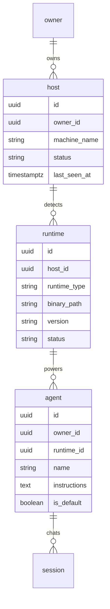
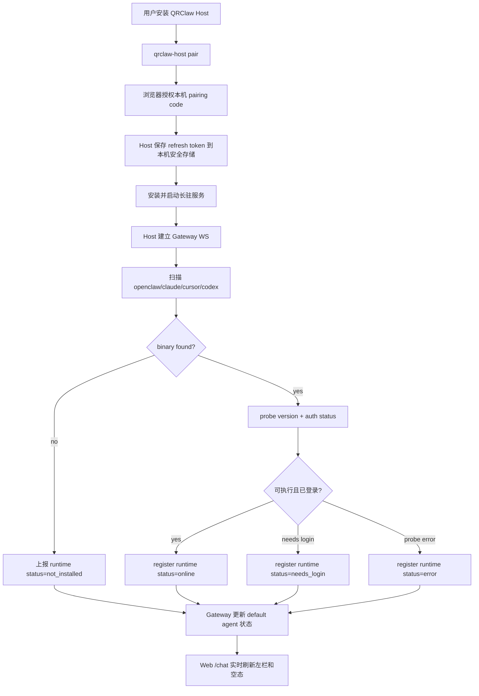

# Wave 10 R1: 本机 CLI 自动检测与首屏交互设计

> 2026-04-28  
> 输入：`wave10-onboarding-vision.md`、Wave 10 Q1/Q2/Q3、`SUMMARY.md`  
> 目标：打开 QRClaw dashboard 后，用户第一眼看到 4 个 runtime 槽位，并能尽快进入 Chat。

## 0. 结论

推荐方案：**本机 Go Host 长驻 + owner 首次登录预建 4 个默认 agent + runtime register 只负责挂载能力与在线态**。

| 问题 | 决策 |
|---|---|
| 自动检测机制 | `qrclaw-agent-host` 作为本机长驻进程；macOS 用 LaunchAgent + 可选菜单栏 App，Linux 用 systemd user service，Windows/WSL 后置 |
| 首次安装引导 | 主推 Mac `.app` / Homebrew；开发者可 `brew install qrclaw-agent-host && qrclaw-host pair && qrclaw-host daemon install --start`；不主推 `curl \| bash` |
| detect 失败回退 | 四个 runtime 槽位始终显示；未检测到时标为“未安装”或“需登录”，不要隐藏 |
| 默认 agent 生成时机 | owner 首次登录时由 Gateway 预建 4 个 default agents；runtime register 后绑定 runtime 并刷新状态 |
| Instructions 默认值 | 不为空；使用每个 runtime 的短 best-practice prompt，用户可改，daemon 不覆盖 |
| 首屏 UI | 登录后默认进 `/chat`；左侧是 Chat/session 列表 + 新建 session，右侧空态展示检测结果与下一步 |

## 1. 范围与不变量

### 1.1 本文负责

- 4 个本机 runtime：`openclaw`、`claude`、`cursor`、`codex`。
- 本机 Host 如何安装、配对、长驻、检测 CLI、注册 runtime。
- 首屏 `/chat` 的空态、左栏列表、新建 session、在线状态展示。
- 默认 agent 的 provision 时机与默认 instructions。

### 1.2 本文不做

- 不改 Host WS 协议字段；Host WS 仍是 Gateway 与本机执行器之间的内部控制面。
- 不设计文件/图片/语音。
- 不把 LobeChat session schema 引入 QRClaw 后端；Conversation 仍是 QRClaw SSoT。
- 不让 Gateway 执行推理或解读消息语义，继续遵守 C1。

### 1.3 C2 边界

本机 daemon 算“端侧客户端”的一部分。明文只允许短暂存在于：

- 浏览器客户端内存；
- 本机 daemon / CLI 子进程内存；
- Gateway 写路径内存，且仅用于加密、转发、SSE 当前响应；
- `decrypted-messages` Edge Function 内存态。

daemon 不写明文消息日志，不缓存明文 transcript，不把 prompt 或 token 写入状态文件。

## 2. Runtime 与 Agent 模型

### 2.1 术语

| 名称 | 含义 |
|---|---|
| Host | 本机长驻的 `qrclaw-agent-host`，负责 pair、detect、heartbeat、spawn CLI |
| Runtime | 某个可执行 CLI 能力，例如 `claude` binary 或 `codex` binary |
| Agent | 用户在 QRClaw 里可点击对话的实体，绑定一个 runtime，但拥有自己的 name/instructions/session |
| Session | owner 与某个 agent 的一次话题会话；后端仍映射到 QRClaw conversation |

### 2.2 目标关系



> T2 会最终确定表结构。T3 的交互决策是：UI 面向 agent/session，runtime 是状态与能力来源。

## 3. 自动检测机制

### 3.1 Host 长驻策略

| 平台 | 机制 | 决策 |
|---|---|---|
| macOS | LaunchAgent + 可选 menu bar App | Wave 10 主路径。LaunchAgent 保证开机自启；menu bar 只负责可见状态、重新扫描、退出 |
| Linux | systemd user service | 支持开发机和服务器；命令为 `qrclaw-host daemon install --user --start` |
| Windows | 后置 | 先支持 WSL 手动运行；Windows Service 不进 Wave 10 |

Go Host 只监听 `127.0.0.1` 的本机调试端口，不暴露公网 HTTP。对 Gateway 仍使用出站 WebSocket，避免 NAT 与防火墙问题。

### 3.2 检测顺序

检测不是只看 PATH。每个 runtime 需要三步：

1. **Locate**：查 PATH、常见安装路径、用户配置路径。
2. **Probe**：执行安全的 `--version` / `version` 命令，设置超时。
3. **Auth check**：执行轻量认证状态检查；无法判断时标为 `needs_login`，不要尝试发真实 prompt。

| Runtime | Locate | Probe | Auth check |
|---|---|---|---|
| Claude Code | `which claude`、`~/.local/bin/claude` | `claude --version` | `claude auth status` 或等价只读命令 |
| Cursor Agent | `which cursor-agent`、`/usr/local/bin/cursor-agent` | `cursor-agent --version` | CLI 支持后接入；暂不可判断则 `unknown` |
| Codex | `which codex`、`~/.bun/bin/codex`、`~/.npm-global/bin/codex` | `codex --version` | 检查本机配置存在性，不读 secret |
| OpenClaw | `which openclaw`、npm global bin | `openclaw --version` | `openclaw whoami/status` |

### 3.3 状态机

| 状态 | 含义 | UI 文案 |
|---|---|---|
| `online` | runtime 可执行、已登录、Host heartbeat 正常 | 本地在线 |
| `offline` | 曾经检测到，但 Host 或 runtime 当前不可用 | 离线 |
| `not_installed` | 未找到 binary | 未安装 |
| `needs_login` | binary 存在，但 CLI 自身未登录 | 需登录 |
| `updating` | Host 正在安装、升级或重新扫描 | 检测中 |
| `error` | probe 超时或异常 | 需要处理 |

检测失败时不隐藏 runtime。隐藏会破坏“打开就看到 4 个 runtime”的心智，也会让用户不知道下一步该装什么。

### 3.4 自动检测流程图



## 4. 首次安装引导

### 4.1 推荐安装路径

主路径：**Mac App + Homebrew formula 共用同一个 Go binary**。

- Mac `.app`：适合非工程心智；提供菜单栏状态、重新扫描、打开 QRClaw、查看日志。
- Homebrew：适合开发者；可脚本化、可更新、符合 CLI 用户习惯。
- npm 包只作为兼容层，不承载 daemon 主分发。
- `curl | bash` 不作为主路径。它适合文档 fallback，但不适合作为默认安全体验。

### 4.2 一键起 Host 的命令

```bash
brew install qrclaw-agent-host
qrclaw-host pair
qrclaw-host daemon install --start
```

`pair` 的用户体验：

```text
$ qrclaw-host pair
Open this URL to pair this machine:
  https://qrclaw.ai/pair?code=ABC-123-XYZ

Waiting for approval...
Paired with zimzheng@example.com
Saved local credential.
```

`daemon install --start` 负责：

- 写入 LaunchAgent / systemd user service；
- 启动 Host；
- 立即执行一次 detect；
- 后台每 30s heartbeat，每 5min 轻量 rescan；
- 用户点击“重新扫描”时强制 rescan。

### 4.3 Web 端安装空态

当 Host 未 paired 或四个 runtime 都未安装时，右侧空态给两个选择：

- “安装 QRClaw Host”：下载 Mac App 或展示 Homebrew 命令。
- “稍后配置”：进入空 Chat，但左栏仍展示 4 个未安装 runtime。

不再展示 host token。host token 可保留在高级/调试页，不进入新手主流程。

## 5. Default Agent Auto-Provision

### 5.1 生成时机

选择：**owner 首次登录后立即预建默认 agents**。

原因：

- 首屏无需等待本机 Host register 才有列表骨架。
- 未安装 runtime 也能明确展示“Claude Code 未安装 / Codex 未安装”。
- runtime register 只做 attach/update，不承担“创建产品对象”的责任。
- 支持未来云端 OpenClaw worker：同一 agent 槽位可从 local runtime 切到 cloud fallback。

### 5.2 Upsert 规则

首次登录创建 4 条 `is_default=true` agent：

| runtime_type | 默认 agent 名 | 初始状态 |
|---|---|---|
| `openclaw` | OpenClaw | `not_installed` |
| `claude` | Claude Code | `not_installed` |
| `cursor` | Cursor Agent | `not_installed` |
| `codex` | Codex | `not_installed` |

runtime register 后：

- 按 `(owner_id, runtime_type, host_id)` 更新 runtime；
- 将同 owner 的 default agent 绑定到最新 online runtime；
- 只更新 `runtime_id/status/version/binary_path/last_seen_at`；
- 不覆盖用户改过的 `name`、`instructions`、头像、分组、置顶。

### 5.3 何时创建 session

不要为 4 个默认 agent 预建空 session。首屏左栏展示的是 agent entry；用户点击某个 agent 或点“新建 session”时再创建 session。

理由：

- 避免数据库里出现一堆从未使用的 conversation。
- 保留 Q3 决策：conversation 是执行上下文，不是纯 UI placeholder。
- UI 仍可用 agent id 作为临时 session key，首次发送消息时由 Gateway get-or-create conversation。

## 6. 默认 Instructions

默认 instructions 不应为空。空字符串会让不同 runtime 的行为差异完全交给 CLI 默认值，用户也看不出“这个 agent 的职责是什么”。也不应只有通用模板。推荐使用短、可编辑、runtime-specific 的 best-practice prompt。

### 6.1 Claude Code

```text
你是 Claude Code，本地代码协作 agent。优先先读相关文件和项目规范，再给出小步、可验证的改动。修改代码后说明验证方式；不要输出或记录 secret、token、密钥或用户私有内容。
```

### 6.2 Cursor Agent

```text
你是 Cursor Agent，擅长在现有代码库中做精准编辑、重构和测试补齐。遵循项目既有风格，保持改动范围小；遇到不确定的产品或契约决策，先指出风险并等待确认。
```

### 6.3 Codex

```text
你是 Codex，本地快速实现 agent。优先给出清晰、直接、可运行的代码改动，避免不必要抽象。完成后列出关键验证命令与仍需人工确认的边界。
```

### 6.4 OpenClaw

```text
你是 OpenClaw 通用 agent，负责把任务拆成可执行步骤，并在需要时协调工具、技能和其他本地 runtime。保持中立转发，不替 QRClaw 后端执行推理或持久化明文内容。
```

## 7. 首屏 UI

### 7.1 信息架构

```text
┌────────────────────────────────────────────────────────────────────────────┐
│ QRClaw                                                   Runtime: 3/4 online │
├──────────────┬──────────────────────────────┬──────────────────────────────┤
│ Nav          │ Chat                          │ Empty / Conversation          │
│              │                              │                              │
│ Chat         │ [+ New Session]              │  欢迎回来，zimzheng           │
│ Agents       │                              │                              │
│ Public       │  ● Claude Code               │  本机 runtime 状态             │
│ Settings     │    本地在线 · claude 1.2.3   │  ● Claude Code    本地在线     │
│              │                              │  ● Cursor Agent   本地在线     │
│              │  ● Cursor Agent              │  ● Codex          本地在线     │
│              │    本地在线 · cursor-agent   │  ○ OpenClaw       未安装       │
│              │                              │                              │
│              │  ● Codex                     │  选择左侧 agent 开始对话，     │
│              │    本地在线 · codex 0.9      │  或创建一个新 session。         │
│              │                              │                              │
│              │  ○ OpenClaw                  │  [安装 OpenClaw] [重新扫描]    │
│              │    未安装                    │                              │
└──────────────┴──────────────────────────────┴──────────────────────────────┘
```

### 7.2 左栏规则

- 左栏顶部固定放 `[+ New Session]`。
- 默认显示 4 个 agent entry；未安装不隐藏。
- 在线状态在 agent 名左侧：绿点 online、灰点 offline/not_installed、黄点 needs_login/updating、红点 error。
- 二级文案显示 `本地在线 · binary/version`、`未安装`、`需登录`、`检测失败`。
- 点击 installed/online agent：打开最新 session 或创建新 session。
- 点击 not_installed agent：右侧显示安装指引，不直接弹复杂 wizard。

### 7.3 右侧初始空态

右侧空态不是“空列表”。它应该回答三个问题：

1. 我现在能用哪些 runtime？
2. 哪些 runtime 还差一步？
3. 下一步最短路径是什么？

推荐文案：

```text
欢迎回来，zimzheng

QRClaw 已检测你的本机 runtime。在线的 agent 可以直接开始对话；
未安装或需登录的 runtime 会保留在左栏，方便你之后补齐。

[重新扫描] [安装缺失 runtime]
```

### 7.4 新建 session

点击 `[+ New Session]` 后展示轻量选择器：

```text
New session

选择一个 agent：
● Claude Code    本地在线
● Cursor Agent   本地在线
● Codex          本地在线
○ OpenClaw       未安装

[Create]
```

默认选中最近在线且最近使用的 agent。未安装项可见但不可选，旁边提供安装链接。

## 8. Detect 失败回退策略

### 8.1 未安装

显示：

```text
OpenClaw 未安装
安装后 QRClaw 会自动重新检测。
[brew install openclaw] [查看文档]
```

### 8.2 已安装但未登录

显示：

```text
Claude Code 需要登录
请在终端完成 claude login，然后点击重新扫描。
[复制命令] [重新扫描]
```

### 8.3 Host 离线

显示：

```text
QRClaw Host 未运行
你的默认 agents 仍保留，但本机 runtime 暂时离线。
[启动 Host] [重新配对]
```

### 8.4 Probe error

显示可操作错误，不打印完整 stderr：

```text
Codex 检测失败
可能是版本过旧或命令超时。
[重新扫描] [查看本机日志]
```

本机日志必须脱敏：不记录 prompt、message content、token、refresh token、DEK/KEK。

## 9. 验收标准
- 新 owner 首次登录 `/chat`，5 秒内看到 4 个默认 runtime/agent 槽位。
- 未安装 CLI 显示为“未安装”，不是隐藏。
- Host paired + running 后，online runtime 在 90 秒内显示“本地在线”。
- 用户点击在线 agent 后可以创建/进入 session，并走 Q2 的 OpenAI SSE 流式回复。
- 用户改过 agent name/instructions 后，Host 重启和 rescan 不覆盖；Host 停止/重启时在线态能在 90 秒内变化。
- Gateway、Host、Web 日志不包含消息明文、instructions 明文之外的用户聊天内容、token、secret。
