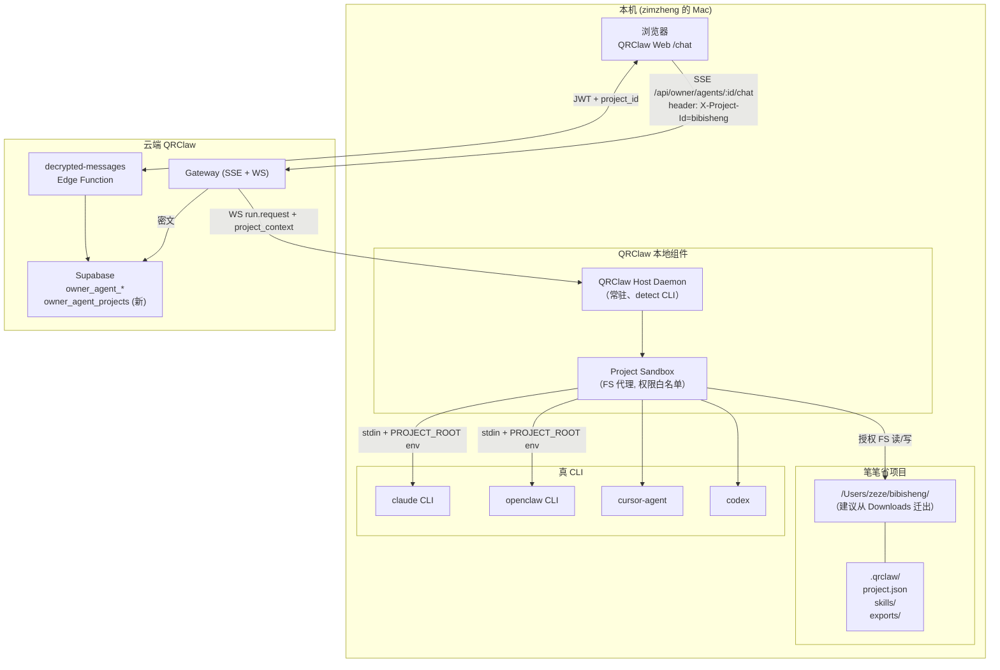
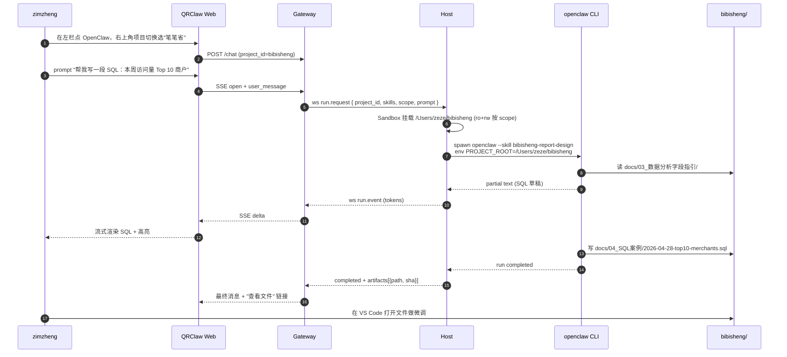
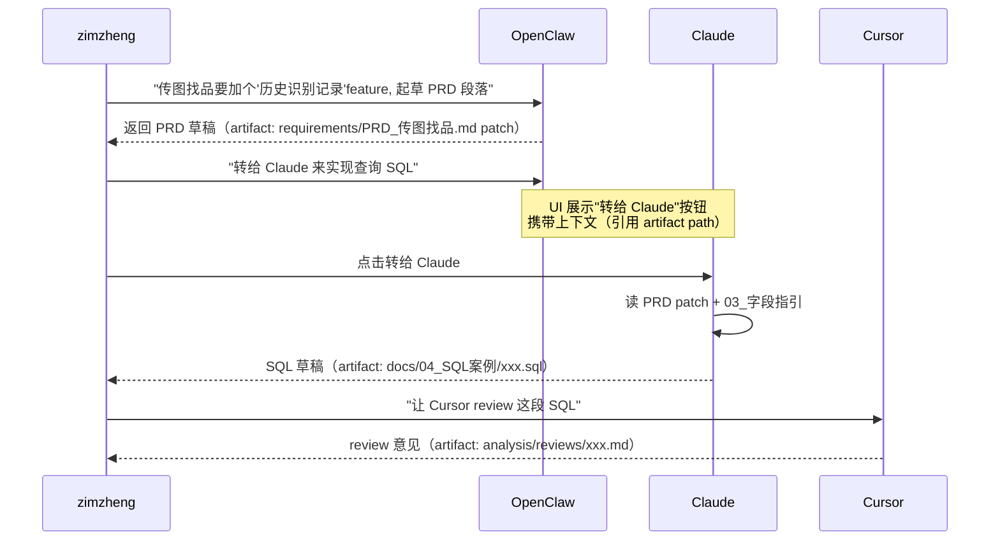

# 笔笔省 × QRClaw 集成方案（R2 独立设计）

> 产出人：R2（架构师）
> 日期：2026-04-28
> 输入：`/Users/zeze/Downloads/openclaw-zimzheng/bibisheng/README.md`、`/Users/zeze/openclaw-clone/skills/bibisheng-report-design/SKILL.md`、Wave 10 决策 `docs/wave10/SUMMARY.md`
> 性质：**集成方案设计**，不改代码、不 build。

---

## 1. 笔笔省现状摘要

### 1.1 项目本质：**文档与数据分析项目**，不是典型代码仓库

| 维度 | 观察 |
|---|---|
| 定位 | zimzheng 运营的业务项目（TAPD workspace 10065171）；OpenClaw Agent 是运营助手 |
| 物理位置 | `/Users/zeze/Downloads/openclaw-zimzheng/bibisheng/`（未见 `.git`，更像工作目录而非 repo） |
| 内容类型 | 80% Markdown（PRD / 数据分析 / SQL 案例）+ 15% 数据文件 + 5% Python 小脚本（send_email / read_email） |
| 主力产物 | (a) HiveSQL 查询与报告；(b) 功能 PRD（当前重点：传图找品）；(c) 业务数据分析 HTML 报告（严格遵循 `bibisheng-report-design` skill 三色规范） |
| 数据面 | 4979 万访问用户、961 万访问商户的业务数据；依赖 HiveSQL、5 表关联限制 |
| 当前 AI 用法 | zimzheng 手动贴 prompt 给 openclaw agent，让其写 SQL / 出 HTML 报告 / 起草 PRD；上下文在每次会话手动 copy-paste |

### 1.2 痛点（推断）

1. **上下文重复粘贴**：每次会话要重新告诉 agent "本项目是笔笔省、三色规范、字段字典在 `03_数据分析字段指引`"。
2. **产出落盘零散**：agent 输出的 SQL、报告 HTML、PRD 片段分散在对话历史里，要手动剪出来塞回目录。
3. **无版本控制**：不是 git repo，diff / rollback 只能人肉 "另存为 v2"。
4. **单 agent 独角戏**：所有任务都让 openclaw 一个 agent 做；它既写 PRD 又写 SQL 又出 HTML，容易出低质量产出。
5. **Skill 文件 vs 项目目录解耦**：`bibisheng-report-design/SKILL.md` 在 `openclaw-clone/skills/`，PRD 在 `Downloads/.../bibisheng/`，两边关联只靠记忆。

### 1.3 这对集成设计意味着什么

- **不需要 "给每个 agent 一个 git worktree" 那种重型方案**——笔笔省不是多人协作的代码库。
- **需要的是 "Project Context" 概念**：让 QRClaw 里的一个 agent session 知道"当前项目=笔笔省"、自动挂载目录、自动注入 skill、产出自动落盘到对的子目录。
- **多 agent 协作的价值不在 code-review / test**（笔笔省几乎没代码），**在于 PRD ↔ 数据分析 ↔ 报告设计 ↔ SQL 实现 的分工**。
- **M3 "workspace 绑定" 必须先落地，因为没它 M2 多 agent 协作没意义**——建议把 M3 部分能力前置到 M2。

---

## 2. 集成架构图



**关键组件（新增 / 改动）**：

| 组件 | 新/改 | 职责 |
|---|---|---|
| `owner_agent_projects` 表 | 新 | `id / owner_id / name / local_path / git_remote(nullable) / skills[] / created_at` |
| `owner_agent_conversation.project_id` | 改 | 把会话绑定到项目 |
| Host Project Sandbox | 新 | 把 `PROJECT_ROOT` / `ALLOWED_READ` / `ALLOWED_WRITE` glob 注入 CLI 进程 env + FS proxy |
| `.qrclaw/project.json`（笔笔省仓库内） | 新 | 项目侧配置：默认 skills、目录白名单、export 目标路径 |

---

## 3. MVP：用户第一次和 agent 聊笔笔省的完整流程

**目标**：把当前"手动粘上下文 + 手动存结果"流程自动化，单 agent（openclaw）即可跑通。

### 3.1 一次性设置（首次 5 分钟）

1. zimzheng 把 `bibisheng/` 从 `Downloads/openclaw-zimzheng/` 迁到 `/Users/zeze/bibisheng/`，`git init`。
2. 在项目根创建 `.qrclaw/project.json`：
   ```json
   {
     "name": "bibisheng",
     "display_name": "笔笔省",
     "default_skills": ["bibisheng-report-design"],
     "read_scope": ["docs/**", "requirements/**", "analysis/**", "data/**"],
     "write_scope": ["analysis/**", "requirements/**", "exports/**"],
     "deny_scope": ["scripts/**/.env", "**/*.secrets.*"],
     "export": {
       "reports": "analysis/reports/",
       "sql": "docs/04_SQL案例/",
       "prd": "requirements/"
     }
   }
   ```
3. 在 QRClaw Web `/projects` 点 "Add Project"，选本地路径 → 后端写 `owner_agent_projects`，把 `.qrclaw/project.json` 的内容 merge 进 DB。

### 3.2 单次会话流程（MVP）



**MVP 关键特性**：
- **Project 切换器**：右上角（或左栏二级菜单）下拉选项目；session 绑定后，所有该 session 的消息都带 `project_id`。
- **自动注入 skill**：`project.json.default_skills` 在 spawn CLI 时通过 `--skill` 或 system prompt 注入。
- **自动挂载目录**：Sandbox 给 CLI 进程 `PROJECT_ROOT` env + 只允许在白名单 glob 内读写。
- **artifacts 回流**：CLI 输出文件后，Host 把文件 path + sha256 作为 artifact 发回 Gateway；Web UI 在消息气泡下方显示 "📄 docs/04_SQL案例/... (点击查看 diff)"。
- **不走加密存储 artifact 内容**：只存 path + sha + 大小；文件本身落在本机仓库，遵守 C1（平台不当内容仓库）。

### 3.3 MVP 验收（用"传图找品 PRD 推进"作用例）

| 步骤 | 断言 |
|---|---|
| 登 QRClaw，选 OpenClaw + 笔笔省 | 左上项目 badge = "笔笔省" |
| 发 "帮我把传图找品 PRD 的测试 case 部分补完" | openclaw 自动读 `requirements/PRD_传图找品.md` 和 `PRD_测试需求.md` |
| Reply 完成 | 新 artifact 写到 `requirements/PRD_传图找品.md`（append），sha256 变化 |
| 去看文件 | 测试 case 段确实被扩展 |

---

## 4. 多 agent 协作（M2 / M3 早期）

### 4.1 笔笔省场景下的合理分工（对原题分工微调）

原题分工（openclaw 产品设计 / claude 代码 / cursor review / codex test）更适合**代码项目**。针对笔笔省的文档型项目，重分工如下：

| Agent | 专长 | 笔笔省中的角色 |
|---|---|---|
| **openclaw** | 有 `bibisheng-report-design` skill + 产品直觉 | PRD 起草 / HTML 报告产出 / 业务需求澄清 |
| **claude** | 长上下文、强结构化推理 | SQL 写作 / 数据字典引用 / 业务指标定义 |
| **cursor** | 擅长 diff 审查 | 审查 PRD 的逻辑自洽、SQL 的语法 / 字段有效性 |
| **codex** | 代码执行 / 沙箱 | 跑 SQL dry-run（语法检查、用模拟 5 表限制）/ 跑 Python 脚本测试 |

### 4.2 协作模式 A：**用户显式编排（M2 默认）**

用户在主 Chat 里驱动，agent 间通过"转交"信号显式传递：



**为什么不做 agent 自动编排**：笔笔省用户只有 zimzheng 一人，人工编排开销低但可控性高；自动编排需要 orchestrator 能力、风险大、与 C1 "不推理" 红线冲突。

### 4.3 协作模式 B：**基础设施能力清单（M2 必须，M3 增强）**

| 能力 | M2 最小版 | M3 增强 |
|---|---|---|
| **共享 project context** | 所有 agent session 看同一个 `project_id`，读同一个目录 | 不变 |
| **artifact 引用** | 消息里可 `@file:path#sha`，其他 agent 能直接读 | artifact 跨 session 版本链（同 path 的多个 sha 形成时间线） |
| **转交动作** | UI 按钮："转给 X"，把当前 bubble + 选中 artifact 塞进目标 agent 的 input | 转交时可选"附加问题模板" |
| **结果聚合视图** | 无（用户自己看各 session） | 一个 "任务看板" 视图：一个 feature 对应多 agent 产出的时间线 |
| **写冲突处理** | pessimistic：同一 artifact path 有未 commit 改动时，禁止第二个 agent 写 | optimistic：三方合并 + 冲突提示 |

### 4.4 示例：传图找品 feature 端到端 M2 流程

```
Day 1 08:00  Claude session  "给我 top10 商户 SQL"                  → docs/04_SQL案例/top10.sql
Day 1 09:00  OpenClaw session "根据这 SQL 结果起草 PRD 验收段落"     → requirements/PRD_传图找品.md (patch)
Day 1 10:00  Cursor session  "review PRD 和 SQL 是否一致"            → analysis/reviews/rv-001.md
Day 1 11:00  Codex session   "dry-run 这段 SQL 语法 + 5 表关联限制" → analysis/reviews/rv-001-sql-check.md
Day 1 12:00  zimzheng 在 VS Code 复核 4 个 artifacts, git commit
```

**zimzheng 全程在 QRClaw Web 里协调**；每个转交动作都有明确 UI 痕迹，可回放（C5）。

---

## 5. git worktree vs 原地操作的取舍

### 5.1 两种方案

| 方案 | 形式 |
|---|---|
| **原地操作** | 所有 agent 共享同一个工作目录 `/Users/zeze/bibisheng/`，靠白名单 + 写锁 + git 版本控制避免互相踩 |
| **Worktree** | Host 为每个 agent session 创建独立 worktree（`.qrclaw/worktrees/<session_id>/`），agent 在自己分支上改，最后 PR 回主 |

### 5.2 决策矩阵

| 维度 | 原地 | Worktree |
|---|---|---|
| 首次上手成本 | 低（zimzheng 已经在用） | 中（要懂 worktree、PR 流） |
| 多 agent 并发安全 | 差（需要写锁） | 好（天然隔离） |
| 产出回流复杂度 | 低（已在主仓） | 高（需要 merge / rebase） |
| 笔笔省场景匹配 | **高**（文档，主要顺序改，冲突少） | 低（overkill） |
| 未来笔笔省转代码化场景 | 差 | 好 |
| C1 影响 | 无 | 无（都在本机） |
| 复杂度来源 | 写锁 + 取消 | worktree 生命周期 + PR 自动化 |

### 5.3 推荐：**两段式** — M2 原地 + 写锁，M3 升级到可选 worktree

**M2（现在）**：
- 只有 zimzheng 一人用，多 agent 并发几率低。
- 关键保护：对任一 artifact path，同一时刻只允许一个 session 写（Host 内存锁，释放条件=run completed 或 10 分钟 timeout）。
- 读无限制；写白名单由 `project.json.write_scope` 定义。

**M3（当笔笔省加入代码或需要多人）**：
- 开启 `project.json.worktree = true`。
- Host 对每个 session 自动 `git worktree add .qrclaw/worktrees/<session-slug> -b agent/<session-slug>`。
- Session 结束时，UI 一键 "合回主分支 (merge)" 或 "开 PR"。
- 失败回滚：worktree 删除不影响主仓。

### 5.4 不推荐：**全程 worktree from day 1**

理由：笔笔省 80% 是 Markdown 顺序编辑，worktree 带来的 mental overhead 对 zimzheng 不划算；冻结 worktree 功能在 `project.json` feature flag 背后即可。

---

## 6. 实现清单

### 6.1 QRClaw 核心代码改动

| 模块 | 改动 | Sprint | 预估工作量 |
|---|---|---|---|
| **DB schema** | 新表 `owner_agent_projects`；给 `owner_agent_conversations` 加 `project_id nullable` | Sprint 3 / M1 尾 | 0.5 d |
| **Gateway API** | `POST /api/owner/projects` CRUD；`/chat` 支持 `project_id` header；run.request 向 Host 带 `project_context` | Sprint 3 | 1.5 d |
| **Host Daemon** | Sandbox 实现（PROJECT_ROOT env + FS scope 校验）；artifact path+sha 上报 | Sprint 3 | 2 d |
| **Web UI** | 左栏顶部 Project 切换器；消息气泡下方 artifact 链接；"转交" 按钮 | Sprint 3 / M2 | 2 d |
| **Skill 注入机制** | CLI spawn 时按 `default_skills` 自动加载 SKILL.md（openclaw 已支持，其他 CLI 作为 system prompt 前缀） | Sprint 3 | 1 d |
| **写锁** | Host 内存锁（`project_id + artifact_path → session_id`） | M2 | 1 d |
| **转交动作** | Web 按钮 + Gateway 端 "fork message + artifact ref 到目标 agent session" | M2 | 2 d |
| **Worktree 模式（feature flag）** | Host 支持创建 / 销毁 worktree，UI 合回按钮 | M3 | 3 d |
| **artifact 版本链** | DB `artifacts(project_id, path, sha, created_by_session)` | M3 | 1 d |
| **RLS / 授权** | project 表只对 owner；artifact 不存内容，仅元数据受 RLS | Sprint 3 | 0.5 d |

**Sprint 3 总计**：~7.5 dev-days（单人一周勉强能装下，建议把 worktree / 转交 / artifact 版本链推到 M2/M3）。

### 6.2 笔笔省仓库侧改动

| 改动 | 内容 | 负责 | 一次性? |
|---|---|---|---|
| **迁移到固定路径** | `Downloads/openclaw-zimzheng/bibisheng` → `/Users/zeze/bibisheng/` | zimzheng | 一次性 |
| **`git init`** | 把笔笔省变成 git 仓库，做首次 commit | zimzheng | 一次性 |
| **新建 `.qrclaw/project.json`** | 按 §3.1 模板填写 | zimzheng | 一次性 |
| **新建 `.qrclaw/skills/` 软链** | 链到 `openclaw-clone/skills/bibisheng-report-design/` | zimzheng | 一次性 |
| **新建 `analysis/reports/`、`exports/`** | 给 agent 产出留落点 | zimzheng | 一次性 |
| **更新 `README.md`** | 增加 "QRClaw 集成" 段：如何打开、默认 agent、default skills | zimzheng | 一次性 |
| **（M3）gitignore `.qrclaw/worktrees/`** | 避免 worktree 污染 | zimzheng | M3 |

### 6.3 顺序建议

```
Week 1 (Sprint 3)  : DB schema + Project CRUD + Sandbox + Project 切换器 + artifact 回流 + MVP 单 agent 跑 §3.3 验收
Week 2 (M2 start) : 转交动作 + 写锁 + 多 agent 分工跑 §4.4 示例
Week 3 (M2 cont.) : artifact 版本链 + 任务看板视图
Week 4 (M3)       : worktree feature flag + 合回 / PR 按钮
```

---

## 7. 开放问题 / 风险

1. **笔笔省 git remote 是否存在？** 当前 README 未说明；若要 M3 worktree + PR，需要一个真 remote（建议私有 GitHub/Gitee）。
2. **HiveSQL dry-run 如何做？** Codex 能跑 Python 但未必能真连 Hive；"dry-run" 可能只是语法检查 + 字段名对照 `03_数据分析字段指引`。
3. **Skill 如何跨 CLI 工作？** openclaw 原生支持 skill；其他 CLI 需要把 SKILL.md 作为 system prompt 前缀注入——长期看会膨胀上下文，可能需要 skill-aware summary。
4. **artifact 不存内容但若 agent 删文件怎么办？** Host 需要在 Sandbox 写操作时做 "deletion 审计"，把删除动作也当 artifact event 上报。
5. **多 session 在同一 project 的 UI 如何不互相干扰？** 左栏目前按 agent 分组；加 project 维度后，可考虑 "项目 → agent sessions" 两级树。
6. **笔笔省 data/ 下有业务数据，是否要 deny_scope？** 推荐 data/ 为 `read_scope` 但不在 `write_scope`；禁止 agent 改原始数据。

---

## 8. 对 Wave 10 SUMMARY 的建议修正

Wave 10 SUMMARY 把 "workspace 绑定 + 多 agent 协作" 放到 M3。基于笔笔省实际需求：

- **Project 切换 + artifact 回流**应前置到 M1 尾端 / Sprint 3（否则 M1 发布后 zimzheng 体验依旧是"手动贴 prompt"）。
- **多 agent 分工 + 转交**放在 M2（和文件图片上传同期）。
- **worktree + PR 自动化**留在 M3。

建议把 SUMMARY §3 月度目标的 M1 成功判据改为：
> dashboard 打开 5 秒内 4 agent 在线，点一个**在笔笔省项目上下文里**流式对话，**产出自动落盘到 bibisheng/**。

---

> **签字**：本方案优先保证"zimzheng 今天就能在 QRClaw 里真正干笔笔省的活"，不为未来 SaaS / 多租户做过度设计。C1/C2/C5 在本方案中都得到保留（platform 不读 artifact 内容，只存 path+sha；对话仍密文；project 关系受 RLS）。
