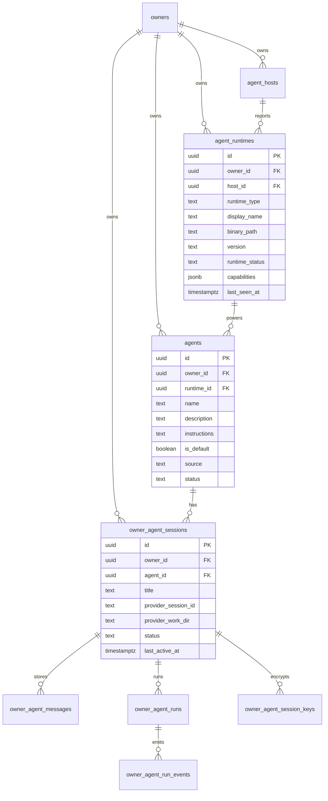

# Wave 10 R2 C1: Runtime / Agent / Session 模型定版

> 输入：`r1-data-model.md`、`r1-arch-independent-review.md`、Multica 实际 repo、用户补充决策。

## 最终决策

**Wave 10 保留三层：Runtime / Agent / Session。**

不采纳“删掉 Agent、只保留 Runtime / Session”的二层方案。原因不是二层没有道理，而是它把 Multica 的命名直接搬进 QRClaw，会和现有产品语义、Wave 5-9 数据资产、用户明确决策冲突。

用户已经确认：“agents 存在，基于 runtime 创建的”。因此本轮定版按这个产品事实收敛：

| 层级 | 最终命名 | 含义 | 是否用户可配置 |
|---|---|---|---|
| Runtime | `agent_runtimes` / Runtime | 本机 CLI 能力实例：claude / cursor / codex / openclaw，来自 host detect | 否，主要由 host 上报 |
| Agent | `agents` / Agent | 基于某个 runtime 创建的可聊天人格/入口，持有 name、instructions、default/source | 是 |
| Session | `owner_agent_sessions` / Session | 某个 Agent 下按话题分的聊天上下文，持有 title、provider_session_id、history 锚点 | 是 |

不引入 `Assistant` 作为新一级名词。`Assistant` 可以作为 UI 文案备选，但 DB/API 继续用 `agents`，避免把已有 `agents`、`agent_bindings`、QR 管理和权限模型再重命名一次。

## Multica 事实校准

Multica 的 repo 里确实有 `AgentConfig`、`DEFAULT_AGENTS`、`agentId`，但它的 “agent” 更接近 QRClaw 的 Runtime：

- `DEFAULT_AGENTS` 是 `claude-code` / `opencode` / `codex` 对应的 command + args。
- `SessionStore` 持久化 `MulticaSession.agentId`，用于记录这个 session 使用哪个 CLI adapter。
- `AgentProcessManager` 对每个 session 启动一个 subprocess，并通过 ACP stdio 建 session。
- 没有 QRClaw 意义上的“可被 owner 创建、改 instructions、挂 QR、做权限边界”的 Agent 实体。

所以映射关系应是：

```text
Multica AgentConfig  ~= QRClaw agent_runtimes.runtime_type + command metadata
Multica Session      ~= QRClaw owner_agent_sessions
QRClaw Agent         ~= Multica 没有的产品层：runtime 上的 persona / assistant entry
```

这解释了 R1 分歧：claude 独立审查从“单人本地极简”出发，认为 Agent 是多余间接层；cursor R1 从 QRClaw 现有资产和用户决策出发，保留 Agent。R2 采用后者，但吸收前者的约束：Agent 层必须轻，不得再承担 runtime detect 或 host 连接职责。

## 最终 ERD



## SQL migration diff

> 这是 Wave 10 目标 diff，不是完整可直接执行 migration。落库时需要同步 Gateway、Edge Function、前端 store、Supabase types 和测试。

```sql
-- Runtime SSoT: 从 agent_host_providers 抽出稳定产品语义。
CREATE TABLE IF NOT EXISTS agent_runtimes (
  id uuid PRIMARY KEY DEFAULT gen_random_uuid(),
  owner_id uuid NOT NULL REFERENCES owners(id) ON DELETE CASCADE,
  host_id uuid REFERENCES agent_hosts(id) ON DELETE SET NULL,
  runtime_type text NOT NULL,
  display_name text NOT NULL,
  binary_path text,
  version text,
  runtime_status text NOT NULL DEFAULT 'offline',
  status_reason text,
  capabilities jsonb NOT NULL DEFAULT '{}'::jsonb,
  metadata jsonb NOT NULL DEFAULT '{}'::jsonb,
  last_seen_at timestamptz,
  created_at timestamptz NOT NULL DEFAULT now(),
  updated_at timestamptz NOT NULL DEFAULT now(),
  CONSTRAINT agent_runtimes_runtime_type_nonempty
    CHECK (length(trim(runtime_type)) > 0),
  CONSTRAINT agent_runtimes_status_check
    CHECK (runtime_status IN ('online', 'offline', 'updating'))
);

CREATE UNIQUE INDEX IF NOT EXISTS uniq_agent_runtimes_owner_host_type
  ON agent_runtimes (
    owner_id,
    (COALESCE(host_id, '00000000-0000-0000-0000-000000000000'::uuid)),
    runtime_type
  );

CREATE INDEX IF NOT EXISTS idx_agent_runtimes_owner_status
  ON agent_runtimes(owner_id, runtime_status, last_seen_at DESC);

ALTER TABLE agent_runtimes ENABLE ROW LEVEL SECURITY;
ALTER TABLE agent_runtimes FORCE ROW LEVEL SECURITY;

CREATE POLICY "agent_runtimes_owner_select" ON agent_runtimes
  FOR SELECT USING (owner_id IN (SELECT id FROM owners WHERE user_id = (SELECT auth.uid())));

CREATE POLICY "agent_runtimes_owner_insert" ON agent_runtimes
  FOR INSERT WITH CHECK (owner_id IN (SELECT id FROM owners WHERE user_id = (SELECT auth.uid())));

CREATE POLICY "agent_runtimes_owner_update" ON agent_runtimes
  FOR UPDATE USING (owner_id IN (SELECT id FROM owners WHERE user_id = (SELECT auth.uid())))
  WITH CHECK (owner_id IN (SELECT id FROM owners WHERE user_id = (SELECT auth.uid())));

CREATE POLICY "agent_runtimes_owner_delete" ON agent_runtimes
  FOR DELETE USING (owner_id IN (SELECT id FROM owners WHERE user_id = (SELECT auth.uid())));

INSERT INTO agent_runtimes (
  owner_id,
  host_id,
  runtime_type,
  display_name,
  binary_path,
  version,
  runtime_status,
  capabilities,
  last_seen_at
)
SELECT
  h.owner_id,
  hp.host_id,
  hp.provider,
  initcap(hp.provider),
  hp.binary_path,
  hp.version,
  CASE WHEN h.status = 'online' AND hp.status = 'available' THEN 'online' ELSE 'offline' END,
  hp.capabilities,
  GREATEST(h.last_seen_at, hp.health_check_passed_at)
FROM agent_host_providers hp
JOIN agent_hosts h ON h.id = hp.host_id
ON CONFLICT DO NOTHING;

ALTER TABLE agents
  ADD COLUMN IF NOT EXISTS runtime_id uuid REFERENCES agent_runtimes(id) ON DELETE SET NULL,
  ADD COLUMN IF NOT EXISTS is_default boolean NOT NULL DEFAULT false,
  ADD COLUMN IF NOT EXISTS source text NOT NULL DEFAULT 'user_created';

ALTER TABLE agents DROP CONSTRAINT IF EXISTS agents_source_check;
ALTER TABLE agents ADD CONSTRAINT agents_source_check
  CHECK (source IN ('system_default', 'user_created', 'imported'));

CREATE INDEX IF NOT EXISTS idx_agents_owner_runtime
  ON agents(owner_id, runtime_id);

CREATE UNIQUE INDEX IF NOT EXISTS uniq_agents_owner_default_runtime
  ON agents(owner_id, runtime_id)
  WHERE is_default = true AND runtime_id IS NOT NULL;

UPDATE agents a
SET runtime_id = r.id
FROM agent_bindings b
JOIN agent_runtimes r
  ON r.owner_id = b.owner_id
 AND r.runtime_type = b.provider
 AND (b.preferred_host_id IS NULL OR r.host_id = b.preferred_host_id)
WHERE b.agent_id = a.id
  AND a.runtime_id IS NULL;

ALTER TABLE owner_agent_conversations RENAME TO owner_agent_sessions;
ALTER TABLE owner_agent_sessions DROP CONSTRAINT IF EXISTS owner_agent_conversations_owner_agent_unique;

ALTER TABLE owner_agent_sessions
  ADD COLUMN IF NOT EXISTS title text NOT NULL DEFAULT 'New chat';

ALTER TABLE owner_agent_sessions DROP CONSTRAINT IF EXISTS owner_agent_sessions_title_length_check;
ALTER TABLE owner_agent_sessions ADD CONSTRAINT owner_agent_sessions_title_length_check
  CHECK (length(title) BETWEEN 1 AND 120);

ALTER TABLE owner_agent_sessions DROP CONSTRAINT IF EXISTS owner_agent_sessions_status_check;
ALTER TABLE owner_agent_sessions ADD CONSTRAINT owner_agent_sessions_status_check
  CHECK (status IN ('active', 'archived'));

ALTER TABLE owner_agent_conversation_keys RENAME TO owner_agent_session_keys;

CREATE INDEX IF NOT EXISTS idx_owner_agent_sessions_agent_last_active
  ON owner_agent_sessions(owner_id, agent_id, last_active_at DESC);

CREATE UNIQUE INDEX IF NOT EXISTS uniq_owner_agent_sessions_owner_agent_title_active
  ON owner_agent_sessions(owner_id, agent_id, lower(title))
  WHERE status = 'active';

CREATE OR REPLACE VIEW owner_agent_conversations
WITH (security_invoker = true) AS
SELECT * FROM owner_agent_sessions;

CREATE OR REPLACE VIEW owner_agent_conversation_keys
WITH (security_invoker = true) AS
SELECT * FROM owner_agent_session_keys;
```

## 不采纳二层的原因

二层模型更像 Multica，也更适合“从零开始的本机桌面 app”。但 QRClaw 不是从零开始：

- `agents` 已经承载 owner 可配置的 name、description、instructions、avatar、visibility、QR 分支入口。
- Wave 5-9 的 message/run/key 表都围绕 `agent_id` 和 conversation/session 锚点建立。
- 用户已经明确“agents 存在，基于 runtime 创建”。
- 直接删除 Agent 会迫使 `instructions` 下沉到 session，导致“同一个人格多个话题”无法复用，未来再加回来反而要二次迁移。

因此 Agent 不应删除，只应降复杂度：Runtime 负责“能不能跑、怎么跑”，Agent 负责“以什么身份跑”，Session 负责“这次聊什么”。

## 反向迁移成本

如果未来又要回到“更强三层”或从二层恢复三层，本方案成本低；因为本轮已经保留 `agents`：

| 未来变化 | 成本 | 说明 |
|---|---:|---|
| Agent 增强为团队共享 Assistant | 低 | `agents` 已是独立实体，只需加 sharing / template 字段 |
| Runtime 一个 Agent 多 runtime fallback | 中 | 加 `agent_runtime_bindings` 多对多表，不破坏 session |
| 回到二层 Runtime + Session | 中高 | 可把 `agents.is_default=true` 折叠为 runtime default profile，但会丢 shared instructions 语义 |
| 本地 sqlite MVP | 中 | 仍可用同三层逻辑建 sqlite 表；不必保留 Supabase/RLS，但概念不变 |
| Cloud sync / 多 owner SaaS | 低 | 三层和现有 RLS、C2 加密模型天然兼容 |

反过来，如果现在采用二层，未来恢复三层需要：

1. 新建 `agents` 或 `personas`。
2. 从每个 session 的 instructions 聚类/回填默认 Agent。
3. 迁移 UI 选择逻辑，从 runtime/session 改回 agent/session。
4. 重建 QR、visibility、权限与 agent 的关系。

这个成本比“现在保留轻量 Agent”更高。

## 迁移执行边界

- `agent_host_providers` 暂不删除，作为 host detect 的原始上报表；`agent_runtimes` 是产品态投影。
- `agent_bindings` 进入兼容期，只读回填；新代码走 `agents.runtime_id`。
- `owner_agent_messages.conversation_id`、`owner_agent_runs.conversation_id` 可在同一 release 改名为 `session_id`，但必须和 Supabase types、Edge Function、Gateway API 一起切。
- C2 不变：messages/run events/key 表继续密文存储，`decrypted-messages` 仍是授权读路径。
- UI 可以学习 Multica：首屏显示 runtime 在线状态，但点击进入的是 runtime 默认 Agent 或用户自建 Agent，再进入 Session。

## 结论一句话

**最终模型是“Runtime 提供执行能力，Agent 提供可复用人格，Session 提供话题上下文”。** 这既尊重 Multica 的 runtime-first 心智，也保留 QRClaw 已经形成的 Agent 产品资产。
