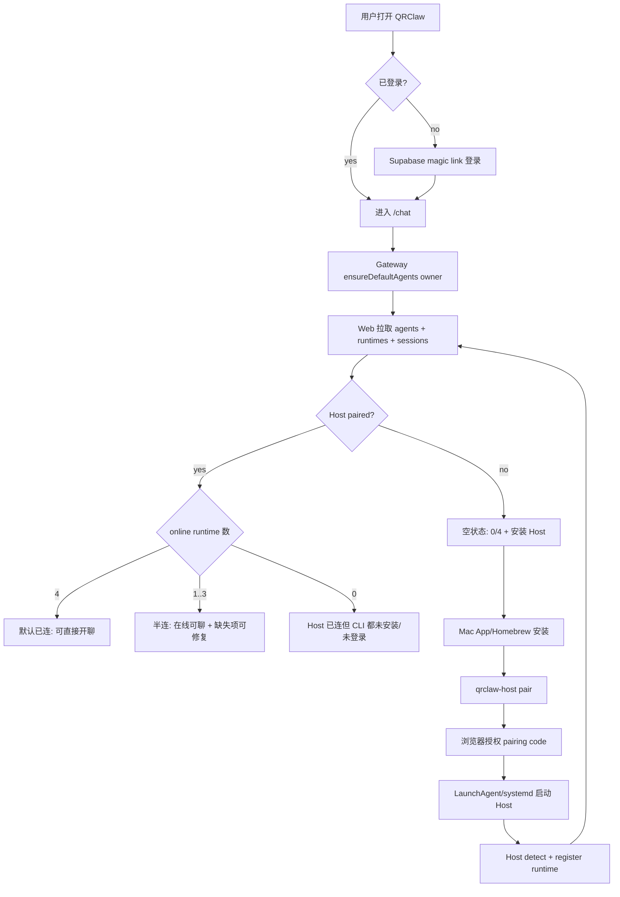

# Wave 10 R2 C5: Onboarding 交互细节定版

> 2026-04-28  
> 输入：`wave10-onboarding-vision.md`、`r1-onboarding-design.md`、`q2-sse-protocol.md`、`q3-session-vs-conversation.md`、`r1-data-model.md`  
> 目标：定版 `/chat` 首屏、Host 安装、默认 runtime/agent、首次登录、session 生命周期和错误态。

## 0. 最终决策

| 问题 | 决策 |
|---|---|
| 首屏 | 登录后默认进入 `/chat`，左栏固定展示 4 个默认 agent 槽位，右侧根据连接状态给下一步 |
| Default 4 agents auto-provision | **开**。owner 首次登录即预建 `openclaw / claude / cursor / codex` 四个 `is_default=true` agent |
| Runtime 未安装 | **显示，不隐藏**。文案为“未安装”并提供单步安装/查看文档；不弹 host token |
| Go Host 长驻 | 主路径：Mac `.app` + LaunchAgent；开发者路径：Homebrew formula；`curl | bash` 只做文档 fallback，不放首屏 |
| 首次登录 flow | 覆盖空状态、默认已连、半连三态；都留在 `/chat`，不强跳 `/agents` |
| 第二屏 onwards | session 是 agent 下的话题会话；支持新建、切换、重命名、归档删除；物理删除后置 |
| 错误态 | runtime offline、CLI auth 失败、网络/SSE 失败都给可恢复动作，日志不展示明文/secret |

## 1. 产品原则

1. 第一眼必须是“这里已经有 4 个本机 runtime 槽位”，不是“先创建 agent”。
2. 未安装和未登录是可修复状态，不是空列表。
3. Host token 不进入新手路径；pairing code / browser approve 是唯一主流程。
4. UI 面向 agent/session；runtime 是执行能力和在线状态来源。
5. Gateway 仍遵守 C1/C2：不执行推理，不把聊天明文落盘或写日志。

## 2. 数据与对象心智

```text
Host = 本机长驻 Go 进程，负责 pair / detect / heartbeat / spawn CLI
Runtime = openclaw / claude / cursor / codex 中某个本机 CLI 能力
Agent = 用户可点击的默认或自建助手，绑定 runtime，持有 name / instructions
Session = 某个 agent 下的一个话题会话，承载消息、run、SSE stream 和历史回放
```

Wave 10 的 UI 文案可以说“Agent”，技术实现继续保留 Runtime/Agent/Session 三层。这样既符合用户“agents 存在，基于 runtime 创建”的心智，也给未来同一 runtime 多 persona 留空间。

## 3. 首屏 Wireframe A：默认已连

```text
┌──────────────────────────────────────────────────────────────────────────────┐
│ QRClaw                                      Runtime 4/4 online     zimzheng   │
├──────────────┬──────────────────────────────┬────────────────────────────────┤
│ Chat         │ Sessions                     │ Welcome back                   │
│ Agents       │                              │                                │
│ Public       │ [+ New Session]              │ 4 个本机 agent 已可用：         │
│ Settings     │                              │                                │
│              │ ● Claude Code                │ ● Claude Code    本地在线       │
│              │   本地在线 · claude 1.2.3    │ ● Cursor Agent   本地在线       │
│              │ ● Cursor Agent               │ ● Codex          本地在线       │
│              │   本地在线 · cursor-agent    │ ● OpenClaw       本地在线       │
│              │ ● Codex                      │                                │
│              │   本地在线 · codex 0.9       │ 选择左侧 agent 或新建 session。 │
│              │ ● OpenClaw                   │ [开始使用 Claude Code]          │
│              │   本地在线 · openclaw 0.4    │                                │
└──────────────┴──────────────────────────────┴────────────────────────────────┘
```

规则：online agent 可直接点击。若该 agent 没有 active session，点击后自动创建标题为 `New chat` 的 session；如果有最近 session，进入最近 session。

## 4. 首屏 Wireframe B：空状态

```text
┌──────────────────────────────────────────────────────────────────────────────┐
│ QRClaw                                      Runtime 0/4 online     zimzheng   │
├──────────────┬──────────────────────────────┬────────────────────────────────┤
│ Chat         │ Sessions                     │ Set up local runtime           │
│ Agents       │                              │                                │
│ Public       │ [+ New Session]              │ 还没有检测到 QRClaw Host。      │
│ Settings     │                              │ 安装后会自动发现本机 CLI。       │
│              │ ○ Claude Code  未安装        │                                │
│              │ ○ Cursor Agent 未安装        │ 1. 安装 QRClaw Host             │
│              │ ○ Codex        未安装        │ 2. 授权这台机器                 │
│              │ ○ OpenClaw     未安装        │ 3. 回到这里自动刷新             │
│              │                              │                                │
│              │                              │ [下载 Mac App] [Homebrew 命令]  │
│              │                              │ [稍后配置]                      │
└──────────────┴──────────────────────────────┴────────────────────────────────┘
```

空状态仍显示四个槽位，避免用户以为系统“没有 agent 概念”。`[+ New Session]` 可点，但只能选择 online/needs_login 之外的可用 agent；0/4 时进入安装引导。

## 5. 首屏 Wireframe C：半连

```text
┌──────────────────────────────────────────────────────────────────────────────┐
│ QRClaw                                      Runtime 2/4 online     zimzheng   │
├──────────────┬──────────────────────────────┬────────────────────────────────┤
│ Chat         │ Sessions                     │ 本机 runtime 状态               │
│ Agents       │                              │                                │
│ Public       │ [+ New Session]              │ ● Claude Code    本地在线       │
│ Settings     │                              │ ● Cursor Agent   本地在线       │
│              │ ● Claude Code  本地在线      │ ◐ Codex          需登录         │
│              │ ● Cursor Agent 本地在线      │ ○ OpenClaw       未安装         │
│              │ ◐ Codex        需登录        │                                │
│              │ ○ OpenClaw     未安装        │ Codex 已安装，但 CLI 未登录。   │
│              │                              │ 在终端完成登录后重新扫描。       │
│              │                              │                                │
│              │                              │ [复制 codex login] [重新扫描]   │
│              │                              │ [安装 OpenClaw]                 │
└──────────────┴──────────────────────────────┴────────────────────────────────┘
```

状态颜色：online 绿点；offline/not_installed 灰点；needs_login/updating 黄点；error 红点。半连时优先让用户先聊在线 agent，而不是阻塞在安装 wizard。

## 6. Host 安装与长驻

推荐分发：

| 用户 | 入口 | 长驻方式 | 说明 |
|---|---|---|---|
| 普通 macOS 用户 | QRClaw Host `.app` | LaunchAgent | 菜单栏显示状态、重新扫描、打开日志、退出 |
| 开发者 | `brew install qrclaw-agent-host` | `qrclaw-host daemon install --start` | 可脚本化，适合 README / CI smoke |
| Linux | release tar + systemd user | `systemctl --user enable --now qrclaw-host` | 支持开发机/服务器 |
| 调试 | 手动 binary | 前台运行 | 只在 Debug docs 中出现 |
| `curl | bash` | 不进主流程 | 可保留在“高级安装” | 避免新手复制不可信脚本 |

Host 只做出站 WS 连接 Gateway，只监听 `127.0.0.1` 调试端口，不暴露公网 HTTP。Host 本机日志必须脱敏，不记录 prompt、消息正文、token、refresh token、DEK/KEK。

## 7. 首次登录 Flow



配对命令：

```bash
brew install qrclaw-agent-host
qrclaw-host pair
qrclaw-host daemon install --start
```

Web `/pair` 页面只显示机器名、pairing code、授权按钮和撤销说明。授权后凭据写入本机安全存储；Web 不展示 host token。

## 8. Default 4 Agents Auto-Provision

开启，且在 owner 首次登录后同步执行。

| runtime_type | 默认 agent | 默认状态 | 初始 instructions |
|---|---|---|---|
| `claude` | Claude Code | `not_installed` | 代码协作，先读项目规范，小步可验证，禁止泄露 secret |
| `cursor` | Cursor Agent | `not_installed` | 精准编辑、重构、补测试，遵循现有代码风格 |
| `codex` | Codex | `not_installed` | 快速实现，代码直接可运行，避免不必要抽象 |
| `openclaw` | OpenClaw | `not_installed` | 拆任务、协调工具和 runtime，保持中立转发 |

Upsert 规则：

- `ensureDefaultAgents(owner_id)` 幂等；缺哪条补哪条。
- Host register 只更新 runtime 绑定、status、version、binary_path、last_seen_at。
- 用户改过 name、instructions、头像、排序后，rescan 不覆盖。
- 不预建空 session；session 在点击 agent 或 `[+ New Session]` 后创建。

## 9. Runtime 未安装展示策略

不隐藏。每个默认 agent entry 有一个状态区：

```text
○ OpenClaw
  未安装
  [安装] [文档]
```

点击未安装项后，右侧展示该 runtime 的最短安装路径：

```text
OpenClaw 未安装

安装后 QRClaw Host 会自动重新检测，无需重新创建 agent。

brew install openclaw

[复制命令] [查看文档] [重新扫描]
```

安装按钮只展示命令或打开下载页，不在浏览器里直接执行本机命令。自动安装需要走 Host `.app` 的本机权限确认，后置到 M2。

## 10. Wireframe D：新建 Session

```text
┌──────────────────────────── New Session ────────────────────────────┐
│ 选择 agent                                                           │
│                                                                      │
│ ● Claude Code     本地在线      最近使用                             │
│ ● Cursor Agent    本地在线                                           │
│ ◐ Codex           需登录        [登录后可用]                          │
│ ○ OpenClaw        未安装        [安装]                                │
│                                                                      │
│ Session title                                                        │
│ [ New chat with Claude Code                                      ]    │
│                                                                      │
│ Instructions                                                         │
│ [使用 Claude Code 默认 instructions v1                         ]      │
│                                                                      │
│                               [Cancel] [Create Session]              │
└──────────────────────────────────────────────────────────────────────┘
```

默认选中最近 online agent；不可用 runtime 可见但不可选。`Create Session` 创建 `owner_agent_sessions`，标题可编辑，instructions 从 agent 默认值复制到 session 初始值，便于未来同 agent 多话题不同上下文。

## 11. Wireframe E：Session 切换

```text
┌──────────────┬────────────────────────────────┬───────────────────────────────┐
│ Chat         │ Sessions                       │ Claude Code / 笔笔省登录页    │
│              │                                │                               │
│ [+ New]      │ Claude Code                    │ User: 修一下登录 redirect      │
│              │  ● 笔笔省登录页        2m      │ Assistant: 我先读路由...       │
│ Claude Code  │  ○ Stripe webhook      昨天    │                               │
│ Cursor Agent │                                │                               │
│ Codex        │ Cursor Agent                   │                               │
│ OpenClaw     │  ○ UI polish           周一    │                               │
│              │                                │                               │
│              │ Search sessions...             │ [Attach] [Message...] [Send]  │
└──────────────┴────────────────────────────────┴───────────────────────────────┘
```

切换规则：

- 左栏第一层仍是 agent；展开后展示该 agent 的 sessions。
- 点击 session 先加载历史，再开始新的 SSE run。
- 如果当前 session 有 in-flight SSE，切换时不自动 cancel；原 run 继续持久化，回切时从历史/事件恢复。
- 搜索 P0 只搜 session title 和 agent name；消息全文搜索受 C2 约束，后置。

## 12. Wireframe F：删除/归档 Session

```text
┌──────────────────── Session actions ────────────────────┐
│ 笔笔省登录页                                             │
│                                                          │
│ [Rename] [Archive] [Duplicate disabled]                  │
│                                                          │
│ Archive this session?                                    │
│ 历史消息会保留加密存储，列表默认隐藏；可在 Archived 查看。 │
│                                                          │
│                              [Cancel] [Archive Session]  │
└──────────────────────────────────────────────────────────┘
```

Wave 10 用 **Archive** 作为删除交互，不做物理删除。原因：消息加密链路、run events、provider session id、C5 回放都挂在 session 上；物理删除需要单独设计级联和审计。UI 文案可显示“删除”，确认框内说明“当前版本会归档，可恢复”。

## 13. 错误态

### 13.1 Runtime offline

```text
Claude Code 离线
QRClaw Host 最近一次心跳超过 90 秒。

[启动 Host] [重新扫描] [查看本机日志]
```

行为：禁用发送按钮；允许浏览历史；若用户点发送，提示“runtime 离线，消息未发送”。

### 13.2 CLI auth 失败

```text
Codex 需要登录
Host 找到了 codex，但 CLI 当前没有有效登录态。

codex login

[复制命令] [我已登录，重新扫描]
```

行为：不要求用户重新 pair Host；只更新 runtime status。

### 13.3 网络 / SSE 失败

```text
连接中断
本次回复仍会在后台继续保存；恢复网络后可刷新历史。

[重试发送] [刷新历史]
```

行为：

- SSE 在首个 chunk 前失败：显示可重试，复用 `client_message_id` 防重复。
- SSE 中途断开：不默认 cancel Host run；Gateway 继续加密持久化 Host events。
- Browser 恢复时走 `GET /api/owner/agents/:id/messages` 和 `decrypted-messages include_events=true` 重建文本。

### 13.4 Host probe error

```text
Cursor Agent 检测失败
可能是版本过旧或命令超时。

[重新扫描] [查看脱敏日志] [报告问题]
```

Probe stderr 只允许写入本机脱敏日志，不回传到 Gateway；Web 只显示错误类别和建议动作。

## 14. SSE 与 Session 约束

- 发送消息使用 `POST /api/owner/agents/:agentId/chat`，返回 OpenAI-compatible SSE。
- Host WS 保留为 Gateway 与 Host 的内部执行协议。
- Owner 浏览器不再依赖 HEL-57 run-event WS 作为新前端主路径。
- `client_message_id` / `Idempotency-Key` 是重试防重的必备字段。
- session 切换、刷新、多 tab 都以持久化历史为准；不要承诺 OpenAI SSE 原生 resume。

## 15. 验收标准

1. 新 owner 首次登录 `/chat`，5 秒内看到 4 个默认 agent 槽位。
2. 4 个默认 agent 自动创建，且重复登录不重复创建。
3. 未安装 runtime 显示“未安装 + 安装动作”，不隐藏。
4. Host paired 后 online runtime 90 秒内变为“本地在线”。
5. 半连状态下 online agent 可直接创建 session 并发起 SSE 对话。
6. 用户可新建、切换、重命名、归档 session；归档不物理删除消息。
7. runtime offline / CLI auth 失败 / 网络失败均有明确恢复动作。
8. Host、Gateway、Web 日志不包含消息明文、token、refresh token、DEK/KEK。
